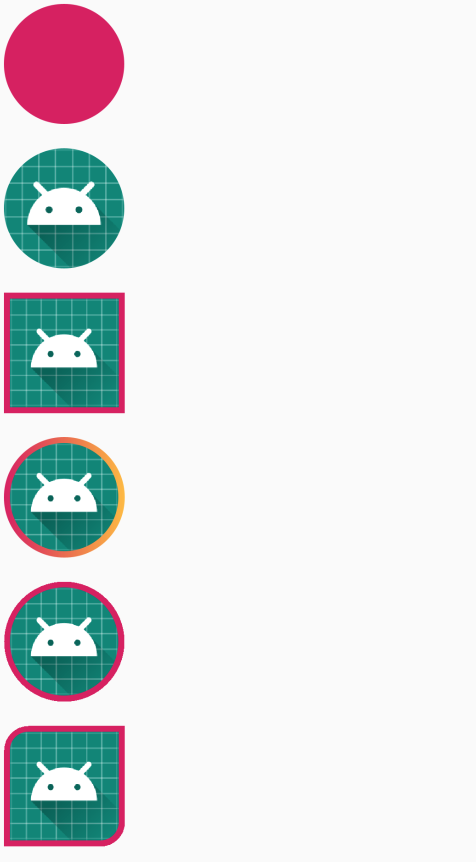

# 增强型ImageViewEx，提供圆角、边框功能、Fresco 替换其他图片框架方案

[](https://search.maven.org/search?q=io.github.taoweiji.image)


1. 提供替换Fresco框架的 SimpleDraweeView
2. 支持设置占位图
3. 支持设置四个圆角
4. 支持圆圈
5. 支持设置边框宽度，颜色

##### 引入项目

```
api 'io.github.taoweiji.image:ImageViewEx:+'
```
替换 Fresco 的 SimpleDraweeView 类
```
api 'io.github.taoweiji.image:SimpleDraweeView:+'
```

##### 使用
```xml
<?xml version="1.0" encoding="utf-8"?>
<LinearLayout xmlns:android="http://schemas.android.com/apk/res/android"
    xmlns:app="http://schemas.android.com/apk/res-auto"
    android:layout_width="match_parent"
    android:layout_height="match_parent">

    <com.taoweiji.image.ImageViewEx
        android:layout_width="100dp"
        android:layout_height="100dp"
        android:layout_margin="10dp"
        android:scaleType="fitCenter"
        android:src="@drawable/ic_launcher"
        app:imageViewEx_asCircle="false"
        app:imageViewEx_borderColor="@color/colorAccent"
        app:imageViewEx_borderWidth="5dp"
        app:imageViewEx_roundBottomLeft="false"
        app:imageViewEx_roundCornerRadius="20dp"
        app:imageViewEx_roundTopRight="false" />
</LinearLayout>

```


##### 效果



## License

    Copyright 2019 taoweiji
    
    Licensed under the Apache License, Version 2.0 (the "License");
    you may not use this file except in compliance with the License.
    You may obtain a copy of the License at
    
       http://www.apache.org/licenses/LICENSE-2.0
    
    Unless required by applicable law or agreed to in writing, software
    distributed under the License is distributed on an "AS IS" BASIS,
    WITHOUT WARRANTIES OR CONDITIONS OF ANY KIND, either express or implied.
    See the License for the specific language governing permissions and
    limitations under the License.

